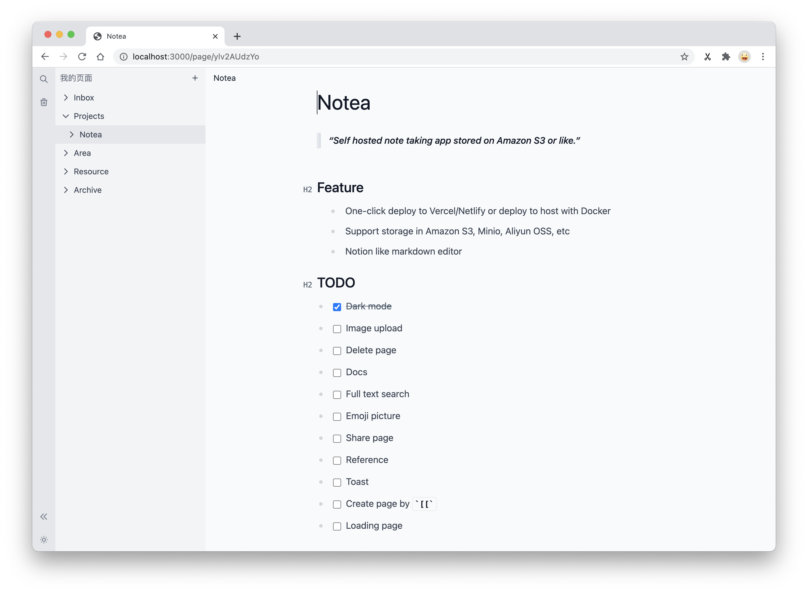

# Notea [WIP]

> Self hosted note taking app stored on Amazon S3 or like.



## Features

- One-click deploy to Vercel/Netlify or deploy to host with Docker
- Support storage in Amazon S3, Minio, Aliyun OSS, etc
- Notion like markdown editor

## Demo

- Link: https://notea.vercel.app
- Password: notea

Data is stored in https://play.minio.io:9000/notea/

## Quickstart

1. [Choose Storage](#storage)
2. [Deploy App](#deploy)
3. Visit your website

## Deploy

### Vercel(Recommanded)

[](https://vercel.com/new/git/external?repository-url=https%3A%2F%2Fgithub.com%2FQingWei-Li%2Fnotea&env=STORE_TYPE,STORE_ACCESS_KEY,STORE_SECRET_KEY,STORE_BUCKET,STORE_END_POINT,PASSWORD&envDescription=Refer%20to%20the%20docs%20to%20set%20environment%20variables&envLink=https%3A%2F%2Fgithub.com%2FQingWei-Li%2Fnotea%23environment-variables&project-name=notea)

### Netlify

### Docker

## Storage

Configure environment variables according to storage mode.

### Minio

`.env`

```sh
STORE_TYPE=MINIO
STORE_ACCESS_KEY=
STORE_SECRET_KEY=
STORE_BUCKET=notea
STORE_END_POINT=
```

### Amazon S3

`.env`

```sh
STORE_TYPE=AWS
STORE_ACCESS_KEY=
STORE_SECRET_KEY=
STORE_BUCKET=notea
STORE_REGION=us-east-1
```

### Aliyun OSS

`.env`

```sh
STORE_TYPE=OSS
STORE_ACCESS_KEY=
STORE_SECRET_KEY=
STORE_BUCKET=notea
STORE_END_POINT=oss-cn-hangzhou.aliyuncs.com
```

## Environment variables

| Name             | Description                  | Default   | Optional              | Required |
| ---------------- | ---------------------------- | --------- | --------------------- | -------- |
| PASSWORD         | password to login to the app |           |                       | true     |
| STORE_TYPE       | storage method               |           | `MINIO`, `OSS`, `AWS` | true     |
| STORE_ACCESS_KEY | accessKey                    |           |                       | true     |
| STORE_SECRET_KEY | secretKey                    |           |                       | true     |
| STORE_BUCKET     | bucket                       |           |                       | true     |
| STORE_END_POINT  | host name or an IP address.  |           |                       |          |
| STORE_REGION     | region                       | us-east-1 |                       |          |

## Development

```sh
cp .env.sample .env
docker-compose up -d
yarn dev
```

## LICENSE

MIT
